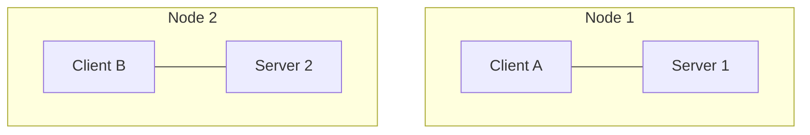
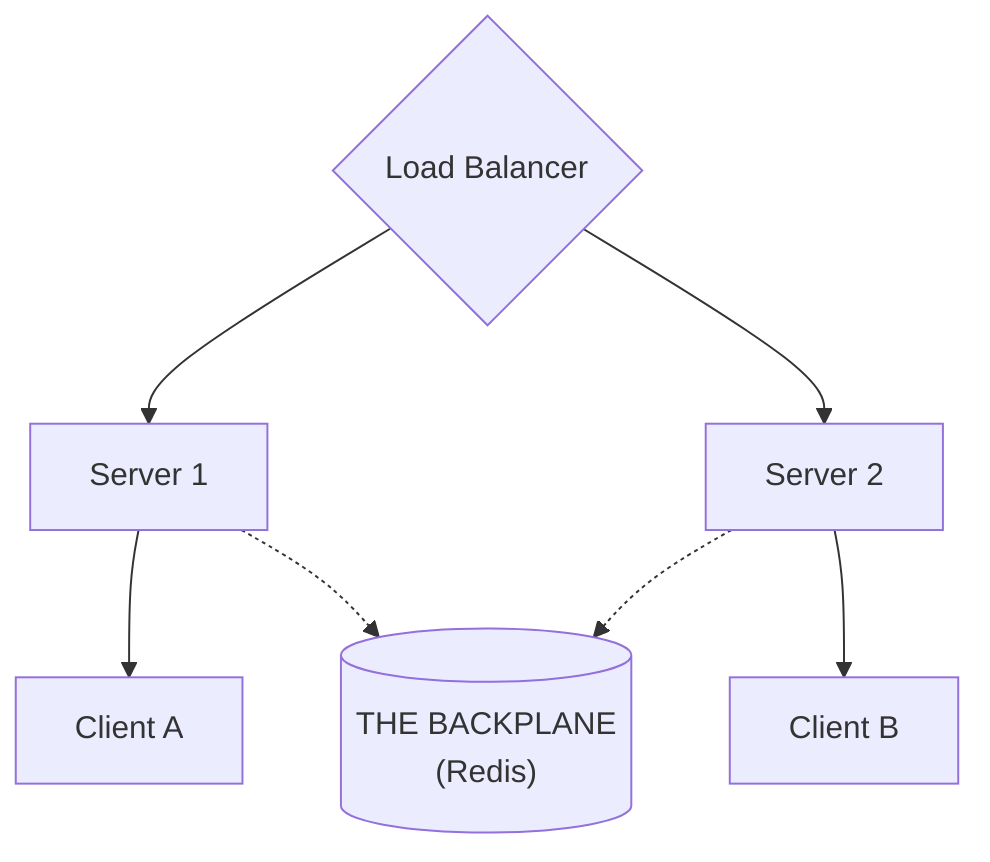
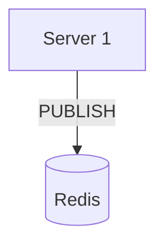
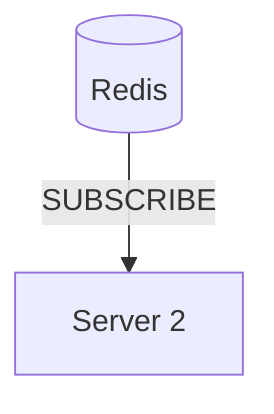
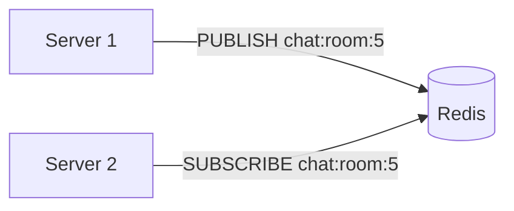
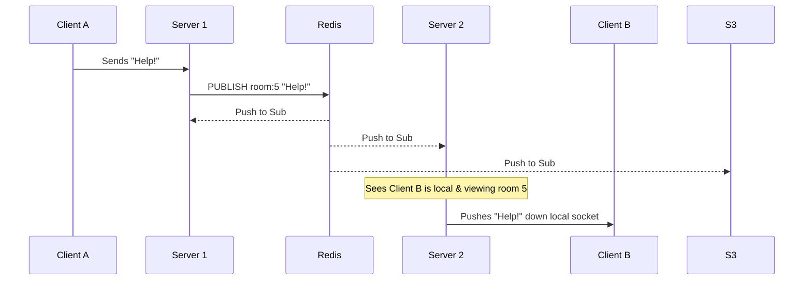
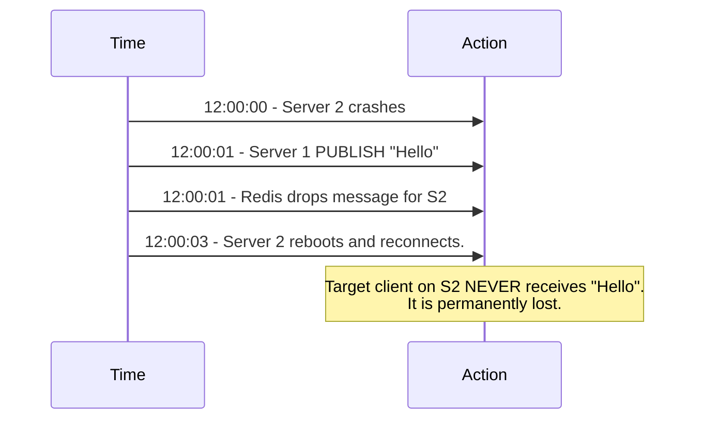
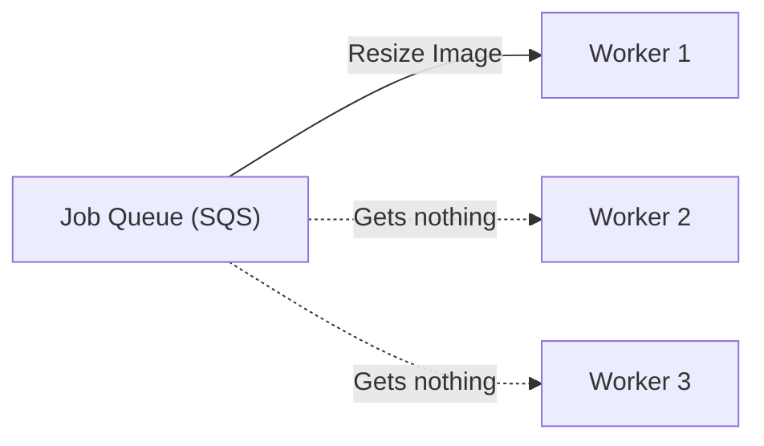
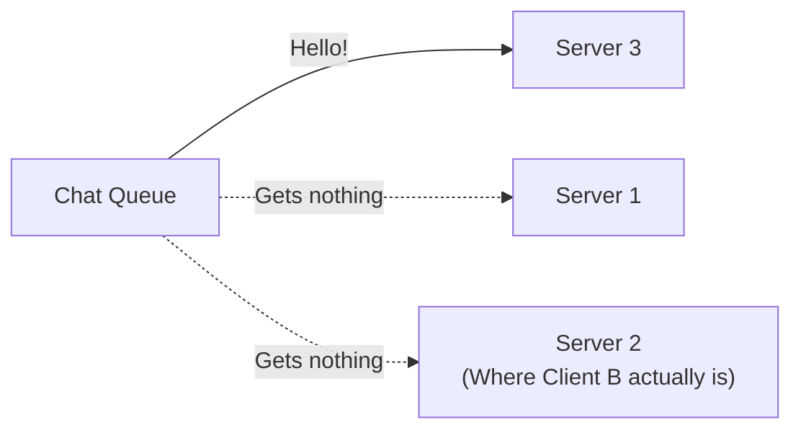
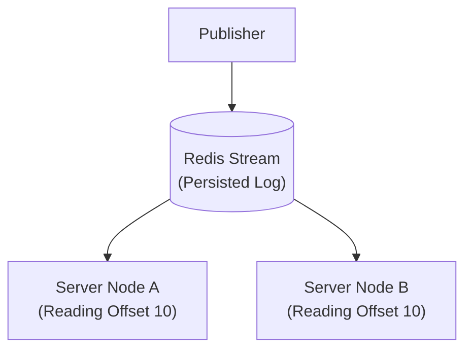

# Chapter 8 — Redis Pub/Sub and the Real-Time Backplane

In the previous chapter, we learned that horizontal scaling intentionally breaks WebSocket communication because connections are stateful. Server 1 literally cannot push a chat message to Client B if Client B is attached to Server 2.

If Client A sends a message in a chat room, Server 1 looks at its local memory and drops it, because it has no idea Client B even exists.

We solve this using a **Backplane**—a central nervous system that allows all WebSocket servers to broadcast messages to each other instantly.

---

## 8.1 The Backplane Concept

A backplane is a high-speed messaging bus that sits behind your WebSocket servers.

Instead of keeping chat messages trapped in local server memory, every time a server receives an event, it shouts it into the Backplane. Simultaneously, every server is continuously listening to the Backplane for updates.

There are many technologies you could use (Kafka, RabbitMQ, NATS), but the undisputed industry standard for WebSocket backplanes is **Redis Pub/Sub**.

---

## 8.2 Redis Pub/Sub Core Concepts

Redis is an in-memory data store. While it is famous for caching database queries, it has an incredibly fast built-in messaging paradigm called **Pub/Sub (Publish/Subscribe)**.

Pub/Sub relies on three core concepts:

### 1. Publishers
A publisher is any entity that sends a message. 

### 2. Subscribers
A subscriber is any entity listening for messages. All active WebSocket servers act as subscribers.

### 3. Channels
A channel is a named topic string. Publishers send messages *to a channel*, and subscribers listen *to a channel*. They do not care about each other's physical IP addresses.

---

## 8.3 Cross-Server Broadcasting in Action

Let's look at exactly how a chat message propagates across a distributed real-time architecture using these channels.

Imagine a user drops a message in a global `Room 5`.

Notice that Server 1 doesn't even need to know Server 2 exists. The servers are completely decoupled. They only know about Redis.

---

## 8.4 The Danger: At-Most-Once Delivery

This is the most critical system-design concept regarding Redis Pub/Sub.

Redis Pub/Sub relies entirely on a **Fire and Forget** mechanism.

> **If a subscriber is not connected at the EXACT millisecond a message is published, the message is permanently lost.**

Redis does not save the message. It does not queue the message. It does not wait for a subscriber to come back online. 

### What happens when a subscriber disconnects?

This model is known as **At-Most-Once Delivery** (The message is delivered exactly zero or one times, but it is never delayed, persisted, or retried).

---

## 8.5 Pub/Sub vs Message Queues

Because Redis Pub/Sub intentionally drops messages, engineers often ask:
> *"Why don't we use a Message Queue like RabbitMQ or AWS SQS?"*

Because Queues and Pub/Sub solve two entirely different architectural problems.

### Message Queues (e.g. SQS, RabbitMQ)
* **Goal:** Distribute heavy work evenly among workers.
* **Mechanism:** 10 workers listen to a queue. If 1 message arrives, **ONLY ONE** worker gets it.

### Why Queues Break Chat Systems
If you use a Queue for a chat backplane, Server 3 might steal the message. 

Server 2 never gets the broadcast, so Client B never sees the chat! For real-time continuous WebSockets, we *need* the strict Fire-and-Forget broadcast mechanism of Pub/Sub.

---

## 8.6 Redis Streams: The Conceptual Bridge

If your real-time application strictly requires *exactly-once* or *at-least-once* delivery and cannot afford dropping messages during a 1-second server blip, you cannot rely entirely on pure Redis Pub/Sub.

You would instead look at **Redis Streams** (or Apache Kafka).

**Redis Streams** provides the broadcast nature of Pub/Sub, but it **persists** the messages.

If a server crashes and comes back online 5 minutes later, it can ask Redis Streams for all messages it missed. 

### Why not use Streams everywhere?
* **Cost:** Persisting high-velocity WebSocket streams in RAM is massively expensive.
* **Complexity:** Managing consumer offsets is vastly more complex than simple fire-and-forget Pub/Sub.

For standard WebSocket backplanes, standard Redis Pub/Sub remains the king of simplicity. (We typically rely on the **Client** to fetch missing messages from the main database when they temporarily disconnect, rather than over-engineering the backplane).

---

⬅️ **[Previous: 7. Scaling WebSockets](07_Scaling_WebSockets.md)** | 🏠 **[Back to TOC](README.md)** | **[Next: 9. Reliability of Real-Time Connections ➡️](09_Real_Time_Reliability.md)**
