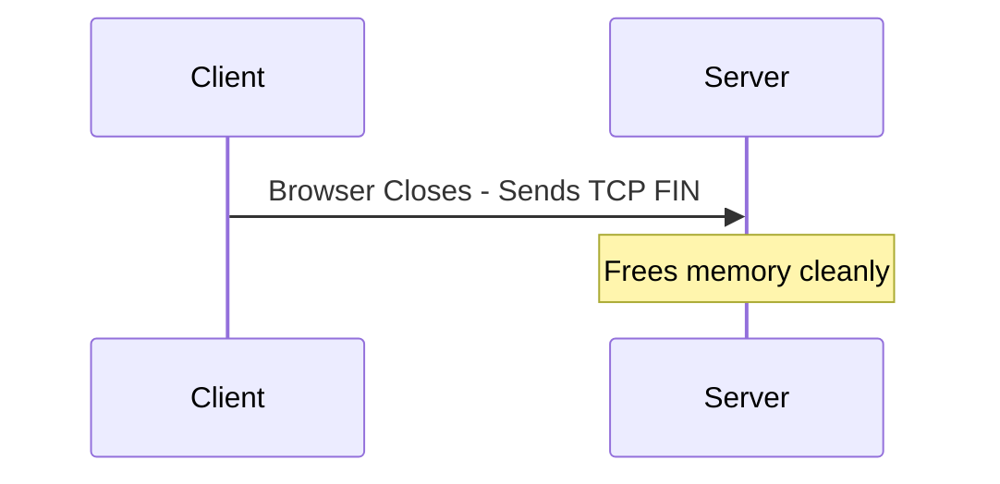
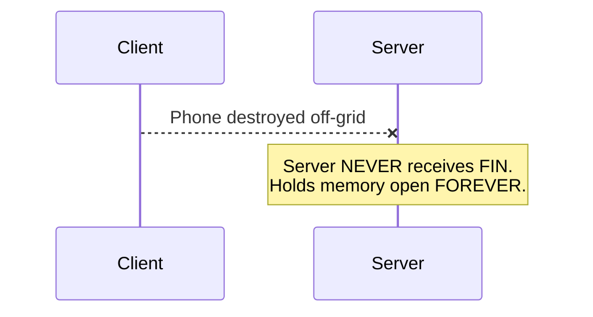
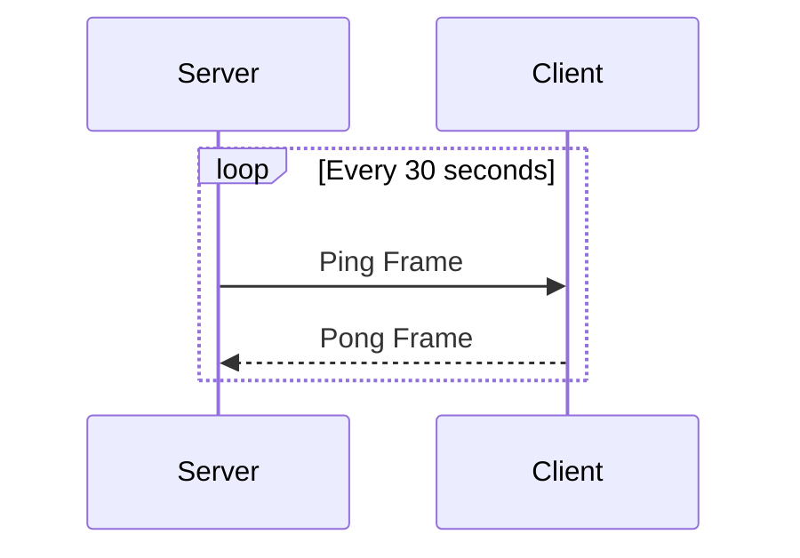
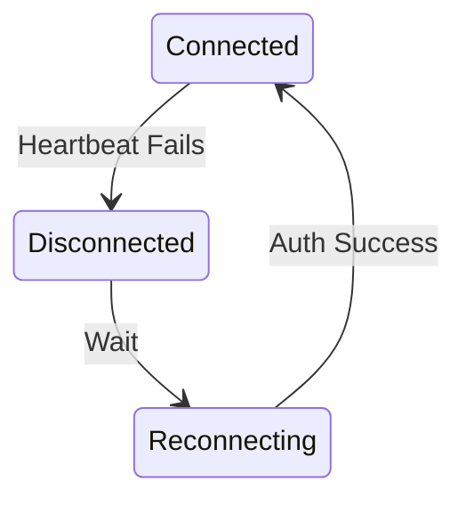
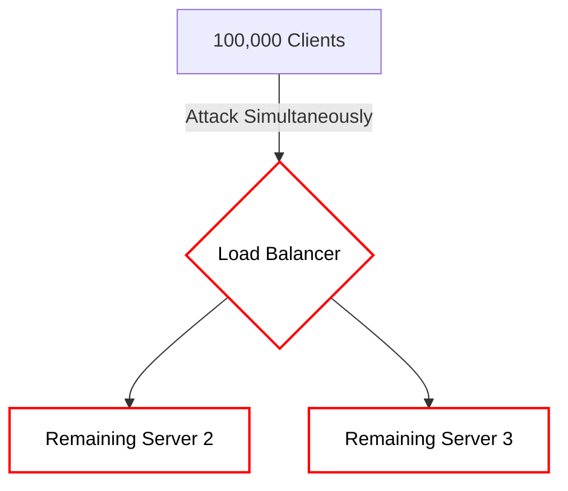
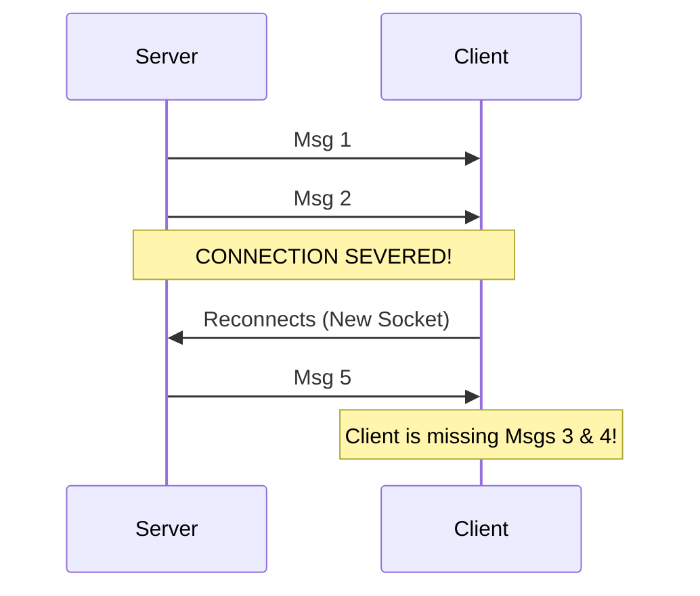
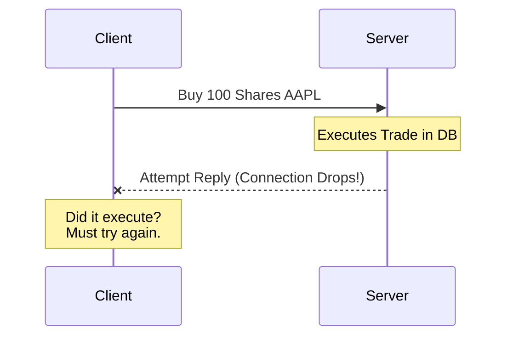

# Chapter 9 — Reliability of Real-Time Connections

Building a real-time system is incredibly easy when everything goes exactly right.

But in the real world:
* Users walk into elevators and lose mobile signal.
* Users close their laptop lids to put them to sleep.
* Routers drop TCP packets randomly.
* Load Balancers intentionally sever idle connections.

Production real-time systems are entirely defined by **how they handle failures**.

---

# 9.1 The "Half-Open" Connection Problem

In normal HTTP, network failure is obvious (you get a `502 Bad Gateway`).
But WebSockets are a **long-lived TCP connection**.

If a client naturally and gracefully closes their browser tab, the browser executes a proper teardown. 



But what if the client drops their phone in a lake?



The server still thinks the client is healthy! It will keep that WebSocket connection completely open, occupying RAM in the OS kernel forever. 

This is called a **Half-Open Connection**. Over time, these ghost connections will crash your server.

---

# 9.2 Heartbeats (Ping / Pong)

To successfully detect half-open connections, real-time protocols rely on **Heartbeats**.

In the core WebSocket protocol specification, there are special low-level frames called `Ping` and `Pong`.



If the server sends a `Ping` and does not receive a `Pong` within a certain timeout window (e.g., 60 seconds), it definitively knows the client is dead.

The server then forcefully closes the local socket, releasing the memory.

---

# 9.3 The Client-Side Network Drop

What if the *server* crashes? 
Clients passively listening to a live feed won't know the server died unless they try to send data. 

Therefore, clients also run a timer based on the server's Pings. If the client hasn't heard a Ping from the server in 45 seconds, it assumes the connection is dead, aggressively kills its local socket, and triggers a reconnect sequence.



---

# 9.4 The Thundering Herd

Imagine you have 100,000 concurrent users connected directly to Server 1.

Server 1 runs out of memory and violently crashes.

Instantly, 100,000 WebSocket connections snap. The 100,000 clients all immediately execute their hard-coded reconnect logic.



A massive, instantaneous tsunami of SSL handshakes and Database Authentication queries slams into your remaining infrastructure at the exact same millisecond.

The database locks up. The remaining servers stall and crash. Your entire platform goes down.

This catastrophic structural failure is known as a **Thundering Herd** or **Reconnect Storm**.

---

# 9.5 Exponential Backoff and Jitter

To prevent a Thundering Herd, you NEVER let clients reconnect immediately in a tight loop.

Instead, you use **Exponential Backoff**:
```text
Delay = base * (2 ^ attempt)

Attempt 1: wait 1 second
Attempt 2: wait 2 seconds
Attempt 3: wait 4 seconds
```

However, if 100,000 clients all wait exactly 1 second, they will still attack the server simultaneously 1 second later. 

To fix this synchronization problem, we must dynamically inject **Jitter** (Randomness) to the mathematical delay.

```text
Delay = Exponential Backoff + Random(0 to 1000 milliseconds)

Client 1: connects at 1.2s
Client 2: connects at 1.8s
Client 3: connects at 1.1s
```

The load on your servers forms a smooth, manageable structural curve instead of a devastating spike. **Always use Jitter.**

---

# 9.6 Graceful Shutdown and Connection Draining

If you just run `kill -9` on a server process to deploy a new version of code, you inadvertently induce a Thundering Herd.

Instead, production real-time servers orchestrate **Connection Draining**:

1. **Stop Traffic:** Instruct Load Balancer to remove Server 1 from routing.
2. **Slow Kick:** Server 1 sends custom WebSocket messages instructing active clients to safely detach in batches (500 users/sec).
3. **Reconnect:** Clients receive the message, detach, and reconnect safely to Server 2.
4. **Shutdown:** Once active connections hit 0, Server 1 terminates securely.

---

# 9.7 Message Reliability (Ordering and Recovery)

Because we use TCP, while the socket is open, messages naturally arrive **in order**.
But what happens when the connection briefly drops?



To natively solve this, we use a hybrid network approach. The client recognizes it's missing data (message #5 arrived after #2) and launches an HTTP fallback `GET /messages?after_id=2` to the primary Postgres database to backfill the gap.

---

# 9.8 Idempotency and Duplicates

What if the network blips exactly as the client is actively sending a critical message?



If the client reconnects and tries again, the server might double-charge them. 

Real-time architectures universally rely on **Idempotency**. Every critical message must include a unique client-generated `message_id`. If the server receives `abc-123-xyz` a second time, it safely ignores the duplicate and just returns the success response.

---

⬅️ **[Previous: 8. Redis Pub/Sub Backplane](08_Redis_PubSub_Backplane.md)** | 🏠 **[Back to TOC](README.md)** | **[Next: 10. Backpressure ➡️](10_Backpressure.md)**
