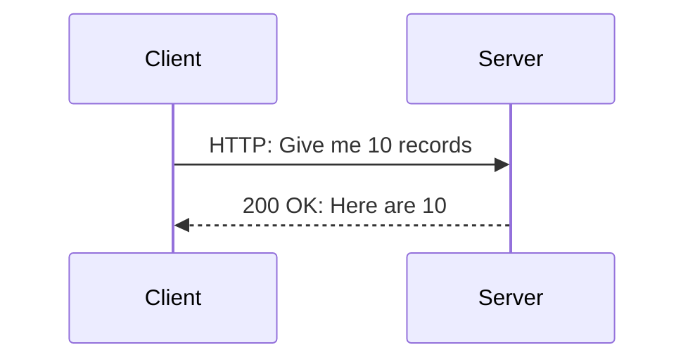
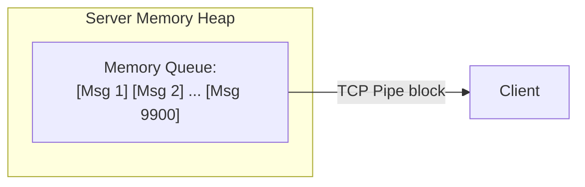
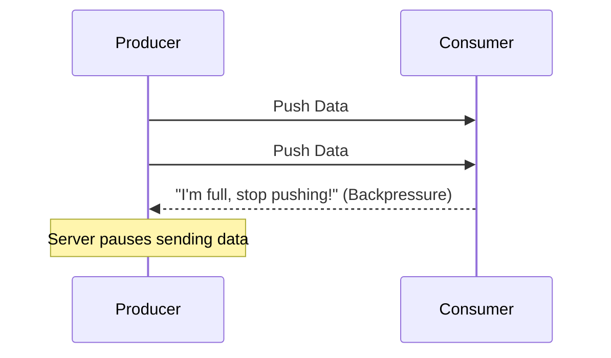
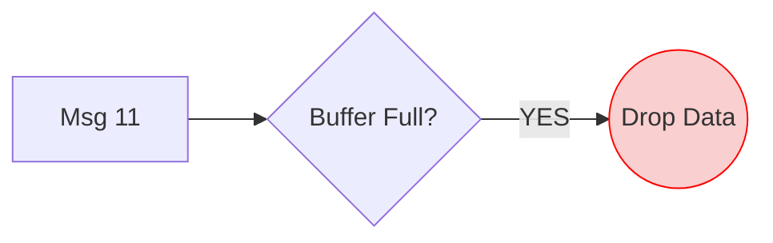
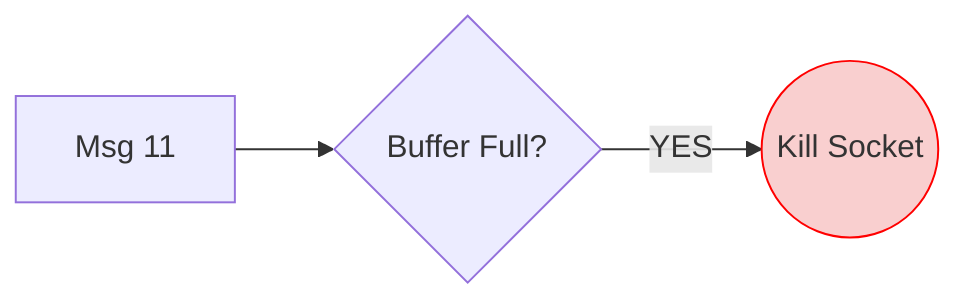
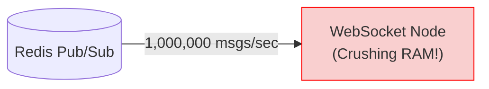
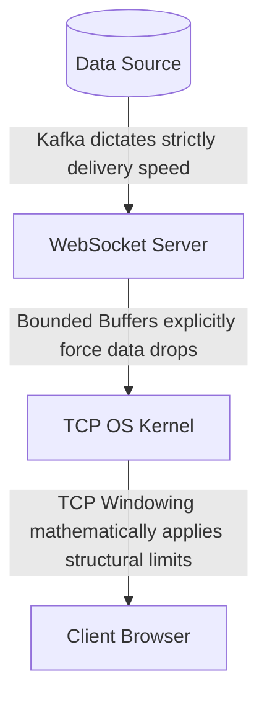

# Chapter 10 — Backpressure

In standard request-response architectures (like a basic REST API), the client maintains ultimate control over the flow of data.



If the client's processor is slow, they simply wait before asking for more. The server does not care.

However, in a real-time push architecture (like WebSockets), the **server actively controls the flow of data**. 

What happens if the server generates data faster than the client can possibly download it?

This introduces one of the most fatal problems in distributed real-time computing: **Backpressure**.

---

# 10.1 Fast Producer vs Slow Consumer

Imagine you are streaming continuous live analytics.
The Server (the Producer) is aggressively generating **10,000 events per second**.

A Client (the Consumer) is logged in via a slow 3G mobile network. They can only process **100 events per second**.

```mermaid
flowchart TD
    S["Server (Producer)"] -->|10,000 msgs/sec| C["Client (Consumer)\nCan only handle 100/sec"]
    style C fill:#f9cfcf,stroke:#ff0000
    Note right of S: 9,900 messages pile up<br>in Server RAM every second!
```

Where exactly do those extra 9,900 messages go? They begin to aggressively pile up in Server memory.

---

# 10.2 Buffers and Infinite Memory Growth

When the server attempts to write a message down a TCP socket to a slow client, the OS kernel intervenes:

> "The client's network window is completely full right now. Please hold this message in your memory buffer until there is physical space on the wire."

The WebSocket server obediently places the message into a local memory **Buffer**.



If the buffer is inherently allowed to grow infinitely, the WebSocket server process will predictably consume 100% of the machine's RAM and violently crash.

A deeply slow client can absolutely weaponize their bad internet connection to inadvertently DDOS and crash your entire cloud infrastructure.

---

# 10.3 Defining Backpressure

**Backpressure** is the physical or logical resistance that a system forcefully applies when it cannot process incoming data fast enough.

In a mathematically healthy network, when a Consumer slows down, they apply physical "backpressure" up the chain, frantically demanding the Producer pause writing.



But standard WebSocket architectures do not have perfect application-level backpressure baked in automatically. We must rigidly handle it in our backend code.

---

# 10.4 Mitigation 1: Bounded Buffers

The absolute simplest mechanism to protect a server's systemic integrity is to apply a hard mathematical limit on every single connection connection buffer.
We enforce a **Bounded Buffer**.

```mermaid
flowchart LR
    Redis -->|Msg 11| S["WebSocket Server"]
    S --o|Buffer Full (MAX: 10)| B["Bounded Buffer"]
    style B fill:#f9cfcf,stroke:#ff0000
```

When Message #11 theoretically arrives, the server explicitly cannot add it to the buffer. It must execute a mitigation strategy.

---

# 10.5 Mitigation 2: Dropping Messages (Lossy Strategy)

If the bounded buffer is full, the most computationally cheap strategy is explicitly to drop any new messages.



The client visibly misses data, but the Server's memory is perfectly protected. This is fiercely common in live-streaming or gaming where older data frames are inherently useless.

---

# 10.6 Mitigation 3: Terminating Connections (Strict Strategy)

Dropping messages silently is catastrophically dangerous if your application strictly guarantees reliable delivery sequentially (like executing financial trades).

Instead of silently corrupting UI states, a robust server will simply kill the physical connection entirely.



The server kicks the struggling client entirely offline. The client will trigger its automatic Exponential Backoff reconnect logic. Upon reconnecting cleanly, it uses standard REST APIs to download exactly what it missed.

---

# 10.7 Mitigation 4: Latest-Value Semantics

If you are streaming continuous telemetry (e.g., Bitcoin prices), you don't necessarily need to queue every single micro-tick.
Instead of utilizing a traditional list buffer, a server uses a **Latest-Value Buffer** (a single variable).

```mermaid
flowchart TD
    subgraph Memory [Server RAM]
    Var["Map: 'BTC' -> 60005"]
    end
    Redis -->|60001| Var
    Redis -->|60002| Var
    Redis -->|60005| Var
    Note right of Var: O(1) Absolute Memory.<br>Value safely overwritten silently.
```

When the client TCP window finally clears, the server organically flushes the absolute latest value across the wire. Memory remains permanently flat regardless of network strain.

---

# 10.8 Upstream Backpressure

So far, we have only discussed protecting the WebSocket Server from a struggling Client. This is **Downstream Backpressure**.

What about protecting the WebSocket Server from a blazing fast Redis Backplane? This is **Upstream Backpressure**.



Redis Pub/Sub does not support upstream backpressure. It fiercely and blindly fires broadcasts at all local servers. 

If your backend intends to generate 1,000,000 massive events a second, you must inevitably replace simple Redis Pub/Sub with **Apache Kafka**, where the WebSocket server robustly controls how fast it pulls messages from the log.

---

# 10.9 The End Goal

A production-ready distributed system respects exact Backpressure at every single physical layer.



If any isolated component securely in this chain stalls, the dominant layers above it must either strategically pause, drop data, or aggressively sever connections to gracefully protect the platform infrastructure.

---

⬅️ **[Previous: 9. Reliability of Real-Time Connections](09_Real_Time_Reliability.md)** | 🏠 **[Back to TOC](README.md)** | **[Next: 11. Presence and Connection State ➡️](11_Presence_System.md)**
