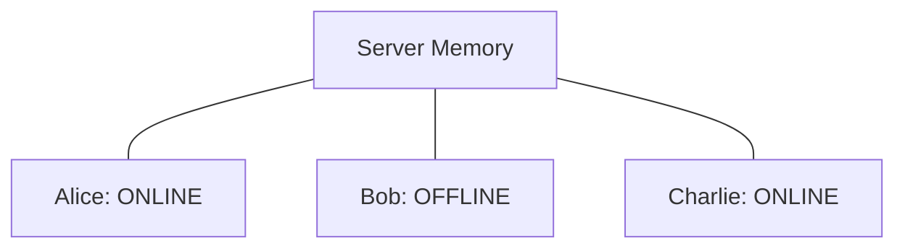
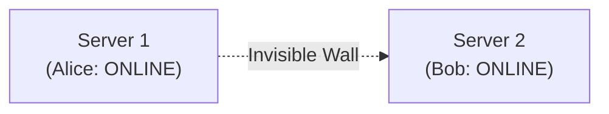
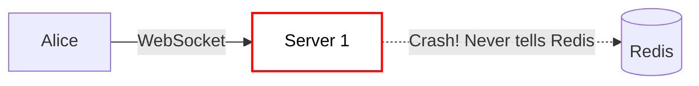
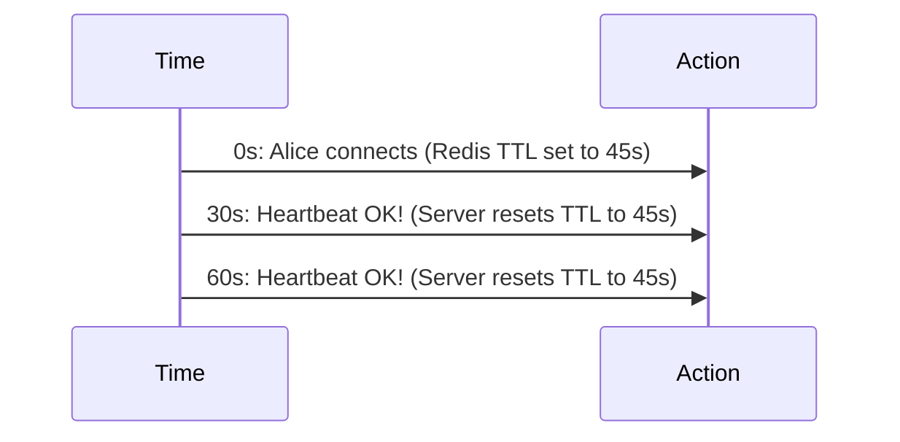
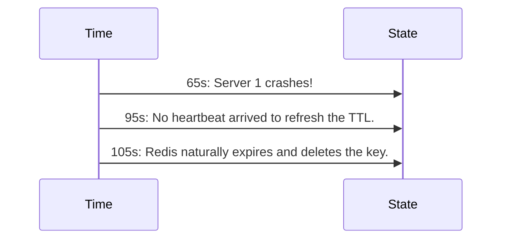
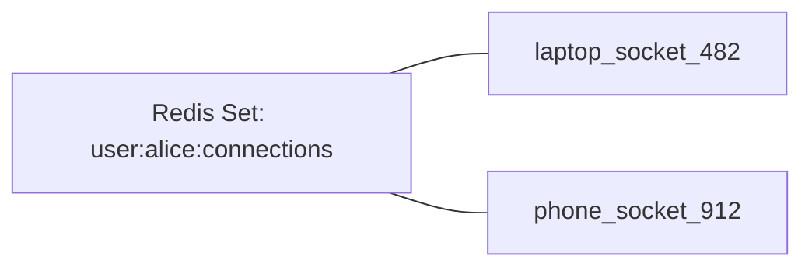
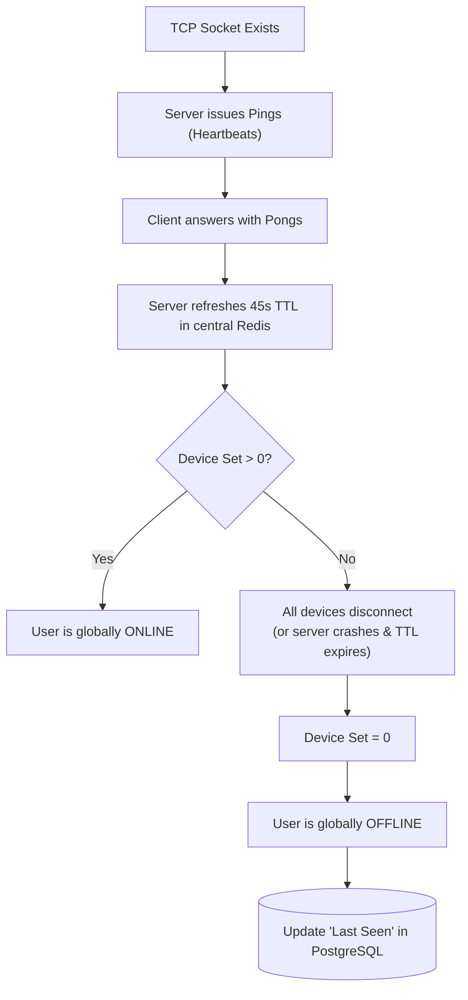

# Chapter 11 — Presence and Connection State

In many real-time applications, simply broadcasting messages isn't enough.

Users also need to know the state of other users.

> "Is Alice online?"
> "When was Bob last seen?"
> "Which device is Charlie currently using?"

This feature is broadly known as a **Presence System**.

---

# 11.1 The Challenge of Distributed Presence

In a single-server application, building a presence system is extraordinarily simple.



When Alice connects her WebSocket, you mark her `ONLINE` in a local hash map. When her socket disconnects, you mark her `OFFLINE`. 

But in a distributed system, Alice connects to Server 1, and Bob connects to Server 2.



Server 1 has absolutely no idea that Bob is online. 
Server 2 has absolutely no idea that Alice is online.

We obviously cannot rely on local server memory anymore. We need a central source of truth.

---

# 11.2 Ephemeral State

Presence data is essentially **Ephemeral State**.

It is highly volatile, constantly changing every second, and deeply tied to the physical status of a TCP connection. 

If we store this in a traditional SQL database:

```sql
UPDATE users SET status = 'ONLINE' WHERE id = 123;
```

With 1,000,000 users connecting and disconnecting constantly, the heavy disk I/O of PostgreSQL/MySQL will rapidly become a massive bottleneck.

Therefore, the industry standard for managing Presence is **Redis**.

Redis gives us blistering fast, purely in-memory read/write speeds, making it the perfect home for volatile presence indicators.

---

# 11.3 The Flawed "On Connect / On Disconnect" Model

Let's try designing a naive Redis presence system.

**Step 1:** Client connects. Server writes to Redis.

```bash
SET user:123:status "ONLINE"
```

**Step 2:** Client gracefully disconnects. Server writes to Redis.

```bash
SET user:123:status "OFFLINE"
```

This looks perfect. What could possibly go wrong?

---

# 11.4 The Ghost Online State

Remember the TCP "Half-Open" connection trap from Chapter 9?

What happens if the Server providing Alice's WebSocket connection violently crashes?



Server 1 never gets the chance to run its "Disconnect" cleanly. It never tells Redis that Alice went offline.

Alice's status in Redis remains permanently locked as `"ONLINE"`.

Your application will tell the entire world that Alice is active and typing, even though her connection died 3 days ago. This is known as a **Ghost Online State**.

---

# 11.5 TTL-Based Presence (The Solution)

We fix Ghost States by enforcing a **TTL (Time-To-Live)** on our Redis presence keys.

Whenever Alice establishes a connection, Server 1 sets her status in Redis with a strict 45-second expiration timer.

```bash
SET user:123:status "ONLINE" EX 45
```

If exactly 45 seconds pass, Redis automatically deletes the key, and Alice naturally appears offline.

But Alice is still actively using the app! How do we keep her online?

We use our **Heartbeats** (Ping/Pong).

---

# 11.6 Tying Presence to Heartbeats

Every 30 seconds, Server 1 successfully exchanges a Ping/Pong with Alice's browser.

Every time that Ping succeeds, Server 1 tells Redis to extend her TTL back up to 45 seconds.



Now, what happens if Server 1 crashes violently at `Time = 65s`?



Alice gracefully drops offline automatically. The Ghost State is impossible!

---

# 11.7 The Multiple Device Problem

As smartphones became ubiquitous, a new problem emerged in Presence design.

Alice logs into the chat app on her **Laptop**.

```bash
SET user:alice:status "ONLINE"
```

Ten minutes later, Alice opens the chat app on her **Phone**. She now has two distinct WebSockets open simultaneously.

Later that night, Alice fully closes the app on her Phone. The Phone's socket cleanly disconnects. 

The Server aggressively marks her OFFLINE.

```bash
SET user:alice:status "OFFLINE"
```

**Wait!**
Her Laptop is fundamentally still open and connected! But the global Redis state just stamped her as entirely offline because one of her devices disconnected.

---

# 11.8 Tracking Distinct Sessions

To solve the Multi-Device conflict, we can never use a single flat string like `"ONLINE"` per user.

We must pivot to tracking **Distinct Devices/Sessions**.

In Redis, instead of a simple string `SET`, we use a Hash (`HSET`) or a Set (`SADD`) to track the unique connection identifiers tied to Alice.



When her phone disconnects, we only remove the phone's socket ID from her presence set.

```bash
SREM user:alice:connections "phone_socket_912"
```

Is she still online?
Yes, because her set still contains `"laptop_socket_482"`. Her global status stays Green.

It is only when her set mathematically reaches exactly `0` elements that the system globally recognizes her as OFFLINE and records her "Last Seen" timestamp into the slower, primary SQL Database.

---

# 11.9 Summary of the Presence Flow

Designing an enterprise-grade Presence layer is surprisingly complex, but relies on a beautiful synthesis of techniques we've already learned.



This architecture brilliantly prevents ghost states and race conditions while seamlessly handling users with multiple simultaneous devices.

---

# 11.10 Presence Subsystems Summary

To summarize the immense complexity required to simply display a "Green Dot", here is a cheat sheet of the subsystems involved:

| Presence Problem | Mitigation Mechanism | Why It Works |
| :--- | :--- | :--- |
| **Silent TCP Drops (Half-Open Sockets)** | Protocol `Ping/Pong` Heartbeats | The server explicitly requests an answer from the client every 30s. If no Pong arrives, the server knows mathematically the socket is dead. |
| **Server Crash Ghost States** | Redis `TTL` (Time-To-Live) Expiration | Even if the server explodes without running its disconnect logic, the central database naturally prunes the stale Presence record after X seconds without a heartbeat. |
| **False-Offline from Multi-Device** | Redis `Sets` / Distinct Session Tracking | Tracking exact physical sockets instead of a boolean value ensures that terminating phone app doesn't accidentally log out the user's desktop browser status. |
| **Thundering Herd Read/Write Load** | Primary Datastore Separation | Relying entirely on an in-memory datastore (Redis) handles the extreme volatility of presence metrics without burying the primary relational database (PostgreSQL) under 100K meaningless TCP-level updates. |

---

⬅️ **[Previous: 10. Backpressure](10_Backpressure.md)** | 🏠 **[Back to TOC](README.md)** | **[Next: 12. Real-Time Architecture ➡️](12_Real_Time_Architecture.md)**
