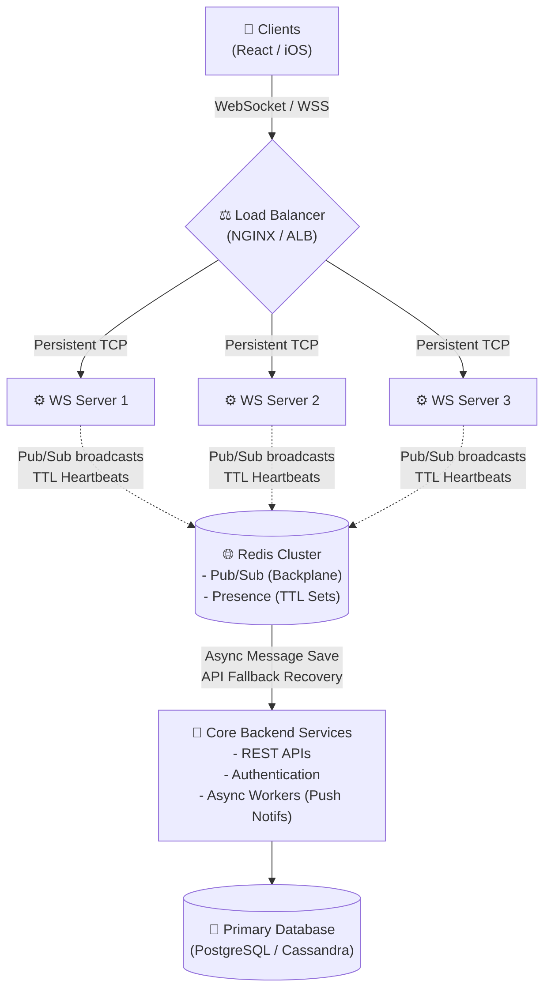
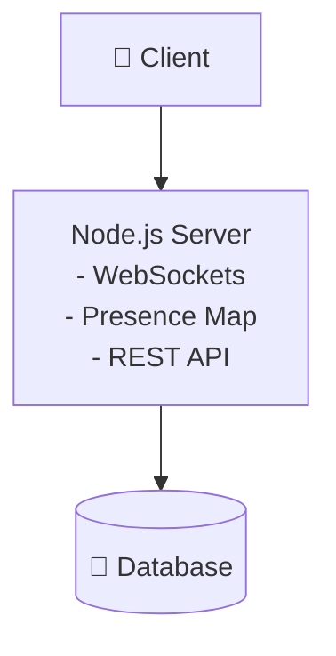

# Chapter 12 — Real-Time Architecture

Over the last 11 chapters, we have deeply studied individual physical components: Polling, SSE, WebSockets, Load Balancers, Message Queues, Redis Publishers, Heartbeats, Backpressure, and TTL tracking.

Now, we zoom completely out. 

It is time to bolt all of these disjointed theoretical concepts together into one massive, cohesive, production-grade distributed architecture.

---

# 12.1 The Master Mental Model

If someone asks you perfectly how a modern, massively scaled Real-Time Chat or Trading application works, this is the architectural blueprint.

This is the exact layout utilized by applications ranging from Discord to Slack, to Robinhood, to modern collaborative SaaS.

Let's trace how the data flows safely through this immense structure.

---

# 12.2 The Connection & Authentication Flow

Unlike standard REST APIs, we cannot elegantly attach HTTP Authorization Headers dynamically to raw WebSocket `Upgrade` requests seamlessly inside browser JavaScript.

Instead, Authentication usually happens through a **Ticket System** or **URI Token**.

### Step 1: The Initial Auth (REST)
Before the client even touches WebSockets, they make a standard HTTP request to the Core Backend API.
`POST /auth/ticket` (Providing their JWT or Credentials).

### Step 2: The Ticket
The Core Backend verifies them and responds with a short-lived (5-second) cryptographic ticket.
`"ticket": "abc-xyz-123"`

### Step 3: Establishing the Socket
The Client connects to the WebSocket cluster via the Load Balancer, passing the ticket in the secure query string:
`wss://sockets.app.com/?ticket=abc-xyz-123`

### Step 4: Verification
The Load Balancer routes the socket to **WS Server 1**. 
WS Server 1 instantly decrypts the ticket (or verifies it rapidly against Redis). 
If it is fake or expired, it kills the socket immediately. If it is valid, it formally upgrades the connection.

---

# 12.3 The Message Flow (Broadcasting)

Let's watch a chat message safely propagate across the platform.

### Step 1: Client Sending
Client sends a chat message heavily bundled with a unique idempotency key ID.
`{ "id": "123", "room": "engineering", "text": "Deploying now!" }`

### Step 2: Server Persistence
**WS Server 1** intercepts it. 
It makes a fast, asynchronous RPC/HTTP call to the **Core Backend Service** telling it to physically save the message in the **Primary PostgreSQL Database**.

### Step 3: Backplane Propagation
Immediately after the DB confirms the save, **WS Server 1** publishes the exact JSON message payload to the **Redis Pub/Sub Backplane** on channel `room:engineering`.

### Step 4: Local Routing
**WS Server 2** and **WS Server 3** instantly pick up the broadcast. 
They look at their local memory heaps, find any users connected to them intimately viewing the engineering room, and push the bytes directly down the TCP sockets to the users.

---

# 12.4 The Failure & Reconnect Flow

Our physical architecture is actively designed to expect massive failure.

### Scenario: WS Server 2 Crashes
If Server 2 runs out of memory or reboots, 50,000 users are immediately kicked offline. 

**How the Architecture recovers safely:**

1. **Presence Clears:** Server 2's ping heartbeats silently stop hitting Redis. Exactly 45 seconds later, the Redis TTL expires, and all 50,000 "ghost" users are mathematically stamped OFFLINE. There is no dirty data.
   
2. **Jitter Reconnect:** The 50,000 clients execute an Exponential Backoff + Jitter algorithm natively. They do NOT crash the Load Balancer simultaneously. They slowly trickle back in.

3. **Routing to Safety:** The Load Balancer realizes Server 2 is dead, and seamlessly redirects all the reconnecting trickles to Server 1 and Server 3.

4. **HTTP Recovery:** Upon successful socket upgrade, the clients realize they were offline for 2 minutes. They bypass the WebSockets completely and fire a `GET /messages?after_id=123` via standard HTTP to the **Core Backend Service**. The primary database cleanly fills their UI gaps.

---

# 12.5 Scaling Down (The Start-Up Compromise)

Does every application actually need this towering architecture? 

Absolutely not.

If you are a startup building a minimal viable product (MVP), you can condense this drastically.

That single monolith architecture will effortlessly support your first 5,000 - 10,000 real-time users. 

It is only when a Load Balancer forces you to spin up a *second* Node.js server that you must fundamentally shatter the monolith, introduce Redis, add the Backplane, split out Presence logic, and adopt the complexities of a distributed system.

---

# 12.6 The Blueprint is Complete

This is what system design legitimately looks like on a whiteboard. 

You don't add Redis because it is "fast."
You add Redis because WebSocket connections are fiercely stateful, and without a Pub/Sub backplane, isolated servers cannot bridge messages to one another. 

Every component is explicitly deployed to solve a rigorous physical or logical limitation of the layer before it.

---

⬅️ **[Previous: 11. Presence and Connection State](11_Presence_System.md)** | 🏠 **[Back to TOC](README.md)** | **[Next: 13. Technology Trade-Offs ➡️](13_Real_Time_Tradeoffs.md)**
