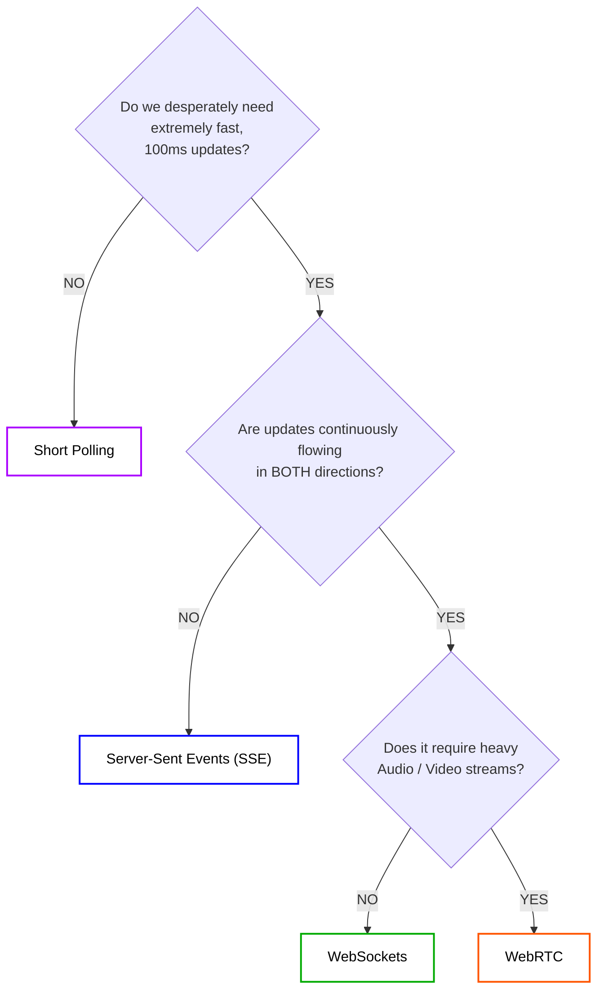
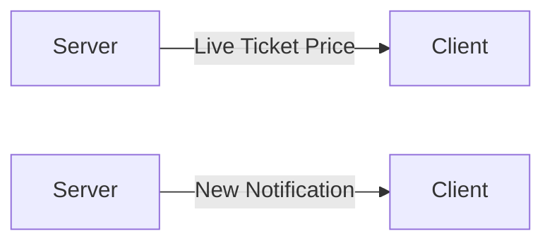

# Chapter 13 — Choosing the Right Real-Time Technology

We have now spent 12 immense chapters breaking down exactly how WebSockets, Polling, SSE, and Distributed Backplanes operate under extreme pressure.

However, recognizing *how* to build something is significantly less important than recognizing *when* to build it.

If you aggressively force WebSockets into an application that organically only needs simple Short Polling, you will invite crushing architectural complexity (Load Balancers, Redis Backplanes, Heartbeats, State Management, Memory leaks) deeply into your codebase for absolutely zero tangible gain.

System Design is entirely about making the correct architectural trade-offs.

---

# 13.1 The Technology Comparison Table

This matrix dictates the core choices.

| Technology    | Communication Flow      | Connection Setup      | Overhead & Scaling Cost | Ideal Use Cases |
| ------------- | ----------------------- | --------------------- | ----------------------- | --------------- |
| **Short Polling** | Client ──► Server   | Repeated HTTP TCP     | Extremely Low to Scale  | Occasional checks (Jobs, Simple analytics) |
| **Long Polling**  | Client ──► Server   | HTTP Request held open| Moderate Server load    | Legacy bypasses where sockets are rigidly blocked |
| **SSE**           | Server ──► Client   | Single Persistent HTTP| Low to Moderate         | Fast 1-way updates (Dashboards, Live Scores, Feeds) |
| **WebSockets**    | Client ◄──► Server  | Full-duplex Persistent| Extremely High (State)  | Bi-directional speed (Chat, Gaming, Trading, Collab tools) |
| **WebRTC**        | Peer ◄──► Peer      | Peer-to-Peer UDP      | High (Requires STUN/TURN)| High-bandwidth data/media (Video / Audio calls) |

---

# 13.2 Do We Even Need "Real-Time"?

Before committing to any of these, ask the most crucial question:

### "Is the user realistically going to sit there and stare at the screen waiting for this data?"

If you are processing a 12-hour video rendering background job, nobody is staring at the screen for 12 hours. The user leaves. They will reliably refresh the page tomorrow. Real-time is utterly useless here.

But if you are building an Uber clone, the user is visibly staring at a driver car on the map waiting for it to explicitly turn left. If it lags by 15 seconds, the user panics. You absolutely mandate Real-Time WebSockets or SSE for the map interface.

> **Let the user's natural freshness expectation dictate the architecture.**

---

# 13.3 The Core Decision Tree

When building a new app, run your requirements exclusively through this logic flow:

---

# 13.4 SSE vs WebSockets (The Great Debate)

This is the most common architectural debate in the industry.

Most engineers aggressively jump straight to WebSockets because WebSockets are "famous."

But if you look closely at standard notification feeds, social media timelines, and stock price tickers, they all flow linearly in a single direction: **Down to the client.**

If you use Server-Sent Events (SSE), you organically side-step massive complexity.

* SSE is structurally native HTTP. It is incredibly easy to seamlessly load-balance using standard algorithms.
* SSE effortlessly handles automatic reconnection natively in the browser without 50 lines of custom Javascript `Jitter` math.
* SSE safely utilizes standard HTTP/2 multiplexing, preventing socket explosion on the server.

You ONLY reach for full WebSockets when the Client is also aggressively firing data backwards (like player coordinates in a multiplayer game or characters in a Google Doc).

---

# 13.5 The Scalability Overhead Rule

Never forget the golden rule of real-time server scaling.

> **When you pick WebSockets, you are sacrificing Statelessness.**

When you are Stateless (Polling/REST), scaling out during a traffic spike is beautifully simple. You boot up 5 more servers, and the Load Balancer flawlessly round-robins requests immediately to them.

When you are Stateful (WebSockets), booting up 5 more servers does almost nothing to help active traffic, because all existing users are mathematically bolted and locked strictly to their current server's memory heap via TCP. 

Scaling Stateful systems requires meticulous Connection Draining, Rebalancing heuristics, and intensely complex Redis Pub/Sub backplanes making sure messages don't shatter across isolated clusters.

---

# 13.6 The Final Takeaway

You have systematically reached the end of the Real-Time Backend track.

You should now look at popular frameworks like Socket.IO, SignalR, or Django Channels not as magical black boxes, but rather as abstracted wrappers sitting directly on top of the exact principles we've rigorously broken down.

You know why they use Heartbeats. You know why they use Redis Adapters. You know exactly what breaks mathematically when a Node.js process crashes without warning.

You are no longer just reacting to architectural problems. 

You are actively engineering resilient, heavily buffered, highly available real-time distributed systems exactly how the titans of the industry design theirs.

---

⬅️ **[Previous: 12. Real-Time Architecture](12_Real_Time_Architecture.md)** | 🏠 **[Back to TOC](README.md)** | **[Next: 14. Glossary and Terminology ➡️](14_Glossary.md)**
